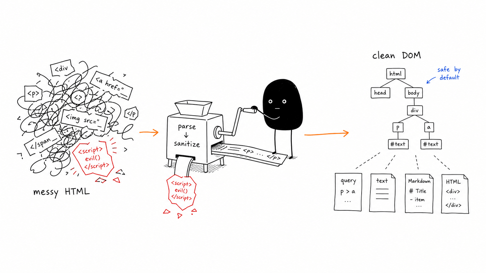

# JustHTML

HTML from the real web is messy. It is often malformed, user supplied, scraped from unknown pages, or headed for a browser where small parsing differences can become security bugs.

JustHTML gives Python projects one small dependency for the common HTML jobs:

- parse HTML like a browser, including broken markup
- sanitize untrusted HTML by default
- query with CSS selectors
- transform, serialize, extract text, or convert to Markdown
- run anywhere Python runs, with no C extension and no system package to install

```bash
pip install justhtml
```

Requires Python 3.10 or later.

[Documentation](https://emilstenstrom.github.io/justhtml/) | [Comparison](docs/comparison.md) | [Playground](https://emilstenstrom.github.io/justhtml/playground/) | [Security policy](SECURITY.md)



## Why Use It?

Most Python HTML libraries optimize for one part of the problem.

`html.parser` is built in, but not HTML5-correct. BeautifulSoup is convenient, but depends heavily on the parser underneath. `lxml` and C/Rust-backed parsers are fast, but usually leave sanitization as a separate concern. `html5lib` and Bleach shaped the Python ecosystem, but both are no longer the obvious foundation for new projects.

JustHTML is for applications that want a boring, inspectable, pure-Python default:

- **Correct parsing:** browser-style HTML5 recovery, tested against the official html5lib fixtures.
- **Safe by default:** `JustHTML(html)` sanitizes before you query or serialize.
- **One DOM:** parse once, then sanitize, query, transform, serialize, extract text, or produce Markdown.
- **Easy deployment:** zero runtime dependencies, no compiler, works on PyPy and Pyodide.
- **Honest tradeoff:** if you are parsing terabytes of trusted HTML, use a C/Rust parser. If you need reliable handling of untrusted or malformed HTML inside a Python app, use JustHTML.

Real-world signal: [Mozilla Support migrated from Bleach to JustHTML](https://github.com/mozilla/kitsune/pull/7236) in Kitsune, the Django application behind support.mozilla.org.

## Quick Start

```python
from justhtml import JustHTML

doc = JustHTML(
    "<p>Hello<script>alert(1)</script> "
    "<a href='javascript:alert(1)'>bad</a> "
    "<a href='https://example.com'>ok</a></p>",
    fragment=True,
)

print(doc.to_html(pretty=False))
# => <p>Hello <a>bad</a> <a href="https://example.com">ok</a></p>
```

Sanitization is enabled by default. Disable it only for trusted input:

```python
doc = JustHTML("<main><p class='intro'>Hello</p></main>", sanitize=False)
intro = doc.query_one("p.intro")

print(intro.to_text())
# => Hello
```

## What You Can Do

```python
from justhtml import JustHTML, Linkify, SetAttrs, Unwrap

doc = JustHTML(
    "<p>Hello <span>world</span> example.com</p>",
    fragment=True,
    sanitize=False,
    transforms=[
        Unwrap("span"),
        Linkify(),
        SetAttrs("a", rel="nofollow"),
    ],
)

print(doc.to_html(pretty=False))
# => <p>Hello world <a href="http://example.com" rel="nofollow">example.com</a></p>
```

JustHTML includes:

- [CSS selectors](docs/selectors.md): `query()` and `query_one()`
- [Sanitization](docs/sanitization.md): allowlisted HTML cleaning, URL policies, inline CSS controls
- [Transforms](docs/transforms.md): unwrap, drop, edit attributes, linkify, compose cleanup pipelines
- [Text output](docs/text.md): `to_text()` and Markdown generation
- [Builder API](docs/building.md): construct nodes directly from Python
- [Streaming](docs/streaming.md): process large inputs incrementally
- [Bleach migration guide](docs/bleach-migration.md): move existing sanitizer code to JustHTML policies

## Command Line

```bash
# Pretty-print an HTML file
justhtml index.html

# Parse from stdin
curl -s https://example.com | justhtml -

# Extract text from selected nodes
justhtml index.html --selector "main p" --format text

# Convert selected HTML to Markdown
justhtml index.html --selector "article" --format markdown
```

## Correctness

JustHTML is tested against the official html5lib tree-construction, serializer, and encoding fixtures, plus project-specific sanitizer, selector, transform, CLI, and regression tests.

The current test suite enforces 100% combined line and branch coverage, including the parser engine.
The parser engine additionally requires exact agreement with the reference path across the html5lib tree suite.
See [Correctness Testing](docs/correctness.md) for details.

## Documentation

- [Quickstart](docs/quickstart.md)
- [Comparison](docs/comparison.md)
- [API Reference](docs/api.md)
- [Sanitization & Security](docs/sanitization.md)
- [Migrating from Bleach](docs/bleach-migration.md)
- [Command Line](docs/cli.md)
- [Full documentation site](https://emilstenstrom.github.io/justhtml/)

## Security

JustHTML sanitizes by default, but output safety still depends on where you put it. HTML body output is not automatically safe inside JavaScript, CSS, URL attributes, or other contexts.

For the supported-version policy and vulnerability reporting, see [SECURITY.md](SECURITY.md).

## License

MIT. Free to use for commercial and non-commercial projects.
